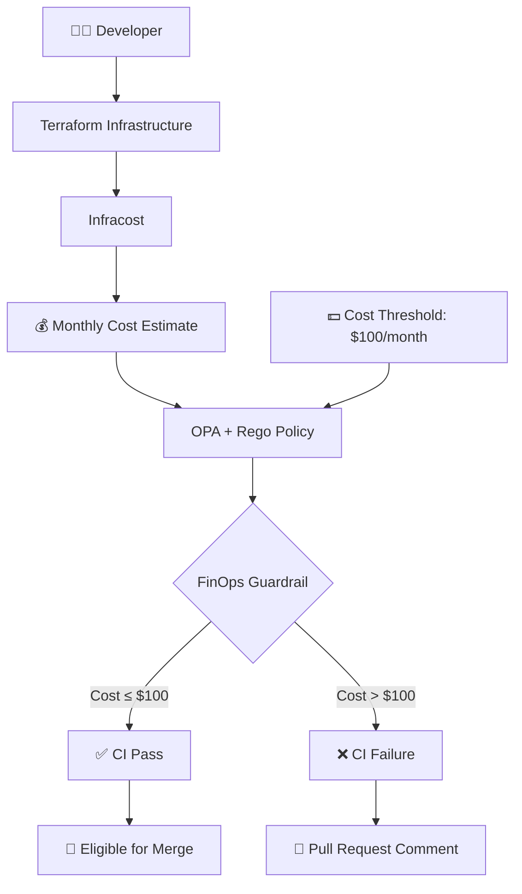

<div align="center">

# 💰 FinOps Policy as Code Engine

### Automated Cloud Cost Governance for Infrastructure Changes

<p>


</p>

<p><b>Prevent over-budget infrastructure changes before they reach production.</b></p>

<p>Terraform → Infracost → OPA/Rego → GitHub Actions → Pull Request Enforcement</p>

</div>

---

## 🚀 Project Overview

**FinOps Policy as Code Engine** is an automated cloud cost governance system that brings financial controls directly into the Infrastructure as Code lifecycle.

The system analyzes Terraform infrastructure, estimates its monthly cost using Infracost, evaluates the estimate against an Open Policy Agent policy written in Rego, and automatically enforces the result through GitHub Actions.

Instead of discovering excessive infrastructure costs after deployment, teams can identify and block non-compliant infrastructure changes during Pull Request review.

### Core Objective

> Treat infrastructure cost as an engineering constraint before infrastructure is deployed.

---

## ✨ Features

- 💰 Automated infrastructure cost estimation using Infracost
- 🛡️ FinOps cost guardrails using Open Policy Agent
- 📜 Version-controlled policies using Rego
- 🔄 Automated Pull Request validation
- ⚙️ GitHub Actions CI/CD integration
- 💬 Automated cost and policy feedback on Pull Requests
- 🚦 Automatic CI failure when cost policies are violated
- 🔐 Secure API key management through GitHub Secrets
- 🐳 Docker-based local OPA policy evaluation
- ☁️ Terraform-based Infrastructure as Code
- 📊 Cost visibility during infrastructure code review

---

## 🏗️ System Architecture



### CI/CD Flow

```text
Pull Request
     ↓
GitHub Actions
     ↓
Checkout Repository
     ↓
Install Infracost
     ↓
Generate Cost Estimate
     ↓
Evaluate OPA/Rego Policy
     ↓
FinOps Guardrail
     ↓
 ┌───────────────┐
 │               │
PASS             FAIL
 │               │
 ↓               ↓
CI Pass       PR Comment
                  +
              CI Failure
```

---

## 🔍 How It Works

### 1. Infrastructure Definition

Infrastructure resources are defined using Terraform.

### 2. Cost Estimation

Infracost analyzes the Terraform configuration and generates an estimated monthly infrastructure cost.

**Example estimated monthly cost: $281.12**

### 3. Policy Evaluation

Open Policy Agent evaluates the Infracost result against a Rego-based FinOps policy.

**Maximum allowed monthly cost: $100.00**

### 4. Automated Enforcement

GitHub Actions executes the complete validation workflow whenever relevant infrastructure or policy files are modified in a Pull Request.

### 5. Policy Violation

When the estimated cost exceeds the configured threshold, the policy returns a failure.

GitHub Actions then fails the CI check and Infracost posts the result to the Pull Request.

---

## 📊 Project Metrics

| Metric | Result |
|---|---:|
| 💰 Estimated Monthly Cost | **$281.12** |
| 🚦 Maximum Allowed Cost | **$100.00** |
| 📈 Amount Above Limit | **$181.12** |
| 📊 Cost Above Threshold | **181.12%** |
| 🛡️ Policy Engine | **Open Policy Agent** |
| 📜 Policy Language | **Rego** |
| 🏗️ Infrastructure | **Terraform** |
| 💵 Cost Engine | **Infracost** |
| ⚙️ CI/CD | **GitHub Actions** |
| 🐳 Local Policy Runtime | **Docker** |

---

## 🔥 Live Policy Enforcement

The system was tested against a Terraform infrastructure configuration producing an estimated monthly cost of:

**$281.12**

The configured maximum monthly cost was:

**$100.00**

The GitHub Actions pipeline successfully:

- Generated the Infracost estimate
- Evaluated the OPA/Rego policy
- Detected the cost violation
- Failed the CI check
- Created an automated Pull Request comment

### Result

**❌ FinOps Policy Violation**

**❌ GitHub Actions Check Failed**

**💬 Pull Request Comment Created**

This demonstrates the complete cost governance workflow from infrastructure code to automated enforcement.

---

## 🛡️ FinOps Policy

The project uses Open Policy Agent with Rego to enforce the monthly infrastructure cost guardrail.

The policy evaluates the estimated monthly infrastructure cost and marks the result as failed when the cost reaches or exceeds the configured limit.

**Current policy threshold: $100.00/month**

The policy is version-controlled alongside the infrastructure code, making financial governance reproducible and auditable.

---

## 📁 Project Structure

```text
finops-policy-as-code-engine/
│
├── .github/
│   └── workflows/
│       └── infracost.yml
│
├── policies/
│   └── cost.rego
│
├── terraform/
│   └── main.tf
│
├── .gitignore
└── README.md
```

Generated Terraform state, plan files, Infracost artifacts, local OPA binaries, and environment-specific files are excluded from version control.

---

## 🧰 Tech Stack

| Technology | Purpose |
|---|---|
| 🟣 Terraform | Infrastructure as Code |
| 💰 Infracost | Cloud infrastructure cost estimation |
| 🛡️ Open Policy Agent | Policy evaluation |
| 📜 Rego | Policy as Code |
| 🐳 Docker | Local OPA execution |
| ⚙️ GitHub Actions | CI/CD automation |
| 🐙 GitHub | Version control and Pull Requests |
| 🔐 GitHub Secrets | Secure API key management |

---

## ⚙️ Getting Started

### Prerequisites

Install the following tools:

- Terraform
- Infracost
- Docker
- Git
- GitHub account

### Clone the Repository

    git clone https://github.com/AryanThakur30/finops-policy-as-code-engine.git
    cd finops-policy-as-code-engine

### Initialize Terraform

    cd terraform
    terraform init

### Generate Terraform Plan

    terraform plan

### Generate Infracost Estimate

    infracost breakdown --path . --format json --out-file ..\infracost.json

### Evaluate the OPA Policy

From the project root:

    .\opa.exe eval -i .\infracost.json -d .\policies\cost.rego "data.infracost.deny"

A cost above the configured threshold should result in a failed policy evaluation.

---

## 🔄 GitHub Actions

The CI/CD workflow is triggered when a Pull Request modifies:

- Terraform configuration
- FinOps policies
- GitHub Actions workflow configuration

The workflow performs:

    Checkout Repository
            ↓
    Install Infracost
            ↓
    Generate Cost Estimate
            ↓
    Evaluate FinOps Policy
            ↓
    Post Pull Request Result
            ↓
        Pass / Fail CI

The Infracost API key is stored securely as the GitHub repository secret:

**INFRACOST_API_KEY**

The secret is never committed to the repository.

---

## 🔐 Security

Sensitive credentials are not stored inside the source code.

The Infracost API key is injected into GitHub Actions through repository secrets.

Generated infrastructure state and local tooling artifacts are excluded through `.gitignore`.

---

## 🎯 Why This Project?

Infrastructure engineering traditionally focuses on whether a deployment is technically valid.

FinOps adds another important question:

> **Is the infrastructure financially acceptable?**

This project integrates that question directly into the development workflow.

Instead of:

    Build → Deploy → Discover Cost

the system enables:

    Build → Estimate Cost → Evaluate Policy → Enforce → Deploy

This approach allows infrastructure teams to detect potentially expensive changes before they become production costs.

---

## 💡 Key Engineering Concepts

This project demonstrates practical implementation of:

- Infrastructure as Code
- FinOps
- Policy as Code
- Open Policy Agent
- Rego
- Cloud cost estimation
- CI/CD automation
- GitHub Pull Request automation
- Automated governance
- Infrastructure cost guardrails
- Secure secret management

---

## 🔮 Future Improvements

- 🎚️ Configurable cost thresholds
- 🌎 Environment-specific budgets
- 📈 Cost increase percentage policies
- 👥 Team-specific budgets
- 🏢 Project-specific cost policies
- 📊 Cost trend analysis
- 🔍 Terraform plan-based cost comparison
- 🚨 Policy severity levels
- 🤖 Automated cost optimization recommendations
- ☁️ Multi-cloud support
- 📑 Detailed cost reports in Pull Requests
- 🔄 Baseline versus Pull Request cost comparison

---

## 🔗 Project Links

| Resource | Link |
|---|---|
| 📦 GitHub Repository | [FinOps Policy as Code Engine](https://github.com/AryanThakur30/finops-policy-as-code-engine) |
| ⚙️ GitHub Actions | [View CI/CD Runs](https://github.com/AryanThakur30/finops-policy-as-code-engine/actions) |
| 🔀 Test Pull Request | [View Pull Request #1](https://github.com/AryanThakur30/finops-policy-as-code-engine/pull/1) |

---

## 👨‍💻 Author

<div align="center">

# Aryan Thakur

### FinOps • Cloud • DevOps • Infrastructure as Code • Policy as Code

<a href="https://github.com/AryanThakur30">

</a>

</div>

---

<div align="center">

### ⭐ If you found this project useful, consider starring the repository.

**Built to bring financial governance into the infrastructure lifecycle.**

</div>
